<architecture_analysis>

Lista komponentów i stron (na podstawie PRD i auth-spec oraz kodu):

- Strony Astro (publiczne): `src/pages/index.astro`, `src/pages/login.astro`, `src/pages/register.astro`
- Nowe strony (publiczne): `src/pages/reset-password.astro`, `src/pages/update-password.astro`
- Layouty: `src/layouts/PublicLayout.astro`, `src/layouts/DashboardLayout.astro`
- Komponenty React (Auth): `src/components/auth/LoginForm.tsx`, `src/components/auth/RegisterForm.tsx`, nowe `ResetPasswordRequestForm.tsx`, `UpdatePasswordForm.tsx`
- Providerzy/stany SPA: `src/components/providers/Providers.tsx`, `src/components/providers/AuthProvider.tsx`, `src/components/providers/QueryProvider.tsx`
- Nawigacja: `src/components/navigation/UserDropdown.tsx`
- UI (Shadcn/ui): `Card`, `Button`, `Input`, `Label`, `Toaster` (i inne z `src/components/ui/*`)
- Middleware: `src/middleware/index.ts`
- Klient HTTP: `src/lib/api-client.ts` (zaktualizować o interceptor Bearer)
- Serwis: `src/lib/services/auth.service.ts` (rozszerzyć o reset/update hasła)
- API (server): `src/pages/api/auth/login.ts`, `register.ts`, `logout.ts`, `account.ts`, nowe `password/reset.ts`, `password/update.ts`
- Supabase SSR/SDK: `src/db/*` (klienci Supabase, sesje SSR)

Główne strony i ich komponenty:

- `/login` → `PublicLayout.astro` → `Providers` → `LoginForm`
- `/register` → `PublicLayout.astro` → `Providers` → `RegisterForm`
- `/reset-password` (nowa) → `PublicLayout.astro` → `Providers` → `ResetPasswordRequestForm`
- `/update-password` (nowa) → `PublicLayout.astro` → `Providers` → `UpdatePasswordForm`
- `/dashboard/*` (chronione) → `DashboardLayout.astro` (SSR sprawdza sesję; przekazuje `initialUser` do `Providers`)

Przepływ danych (wysoki poziom):

- SSR: `middleware` tworzy klienta Supabase i dla `/dashboard/*` wymusza zalogowanie (`getSession()`), przekazując `locals.user` do layoutu. Publiczne strony `/login` i `/register` sprawdzają sesję i redirectują do dashboardu, jeśli zalogowany.
- SPA: Formularze (`LoginForm`, `RegisterForm`, nowe: `ResetPasswordRequestForm`, `UpdatePasswordForm`) wywołują `apiClient` → `/api/auth/*`. Po sukcesie `AuthProvider` aktualizuje `user` i wykonuje redirect. `apiClient` globalnie obsługuje 401 (redirect do `/login`).
- API: Endpointy auth wywołują `AuthService` (Supabase Auth). Dla chronionych tras API middleware weryfikuje nagłówek `Authorization: Bearer <access_token>` i ustawia `locals.user`.
- Reset/aktualizacja hasła: `password/reset` wysyła email resetujący. Link prowadzi do `/update-password`; Supabase ustanawia sesję z linku; `password/update` ustawia nowe hasło.

Opisy funkcjonalne kluczowych elementów:

- `PublicLayout.astro`: Layout stron publicznych; montuje `Providers` i wyspy React.
- `DashboardLayout.astro`: Layout chroniony; zależy od `locals.user` ustawionego w middleware; przekazuje `initialUser` do `Providers`.
- `LoginForm`/`RegisterForm`: Walidacja (Zod), POST do `/api/auth/login|register`, aktualizacja `AuthProvider.user`. `LoginForm` doda link „Nie pamiętasz hasła?”.
- `ResetPasswordRequestForm` (nowy): Walidacja email; POST do `/api/auth/password/reset`; komunikat neutralny.
- `UpdatePasswordForm` (nowy): Walidacja siły hasła; POST do `/api/auth/password/update`; redirect do `/login` po sukcesie.
- `AuthProvider`: Przechowuje `user`, `isAuthenticated`, `fetchCurrentUser()` (GET `/api/auth/account`).
- `apiClient`: Axios z `withCredentials`; dodać interceptor dopinający `Authorization: Bearer` z bieżącej sesji Supabase; obsługa 401 (redirect).
- `middleware/index.ts`: SSR sesji dla stron, weryfikacja Bearer dla `/api/*` (z wyjątkiem PUBLIC `/api/auth/login|register|password/reset|password/update`), rate limit wybranych tras.
- `AuthService`: Fasada nad Supabase Auth (login, register, logout, delete, reset, update password; mapowanie błędów).

```mermaid
flowchart TD

%% Klastery UI
subgraph LAYOUTS["Layouty Astro"]
  L_Public["PublicLayout.astro"]
  L_Dashboard["DashboardLayout.astro"]
end

subgraph PAGES_PUBLIC["Strony publiczne (Astro)"]
  P_Index["/index.astro"]
  P_Login["/login.astro"]
  P_Register["/register.astro"]
  P_Reset["/reset-password.astro"]
  P_Update["/update-password.astro"]
end

subgraph SPA_INFRA["Stan i infrastruktura SPA"]
  S_Providers["Providers.tsx"]
  S_AuthProvider["AuthProvider.tsx"]
  S_QueryProvider["QueryProvider.tsx"]
  S_ApiClient["api-client.ts (Axios)"]
  UI_Toaster["Toaster"]
end

subgraph AUTH_COMPONENTS["Komponenty React – Autentykacja"]
  C_LoginForm["LoginForm.tsx"]
  C_RegisterForm["RegisterForm.tsx"]
  C_ResetForm["ResetPasswordRequestForm.tsx"]
  C_UpdateForm["UpdatePasswordForm.tsx"]
end

subgraph NAV["Nawigacja (SPA)"]
  C_UserDropdown["UserDropdown.tsx"]
end

subgraph API_SERVER["API (server)"]
  API_Login["POST /api/auth/login"]
  API_Register["POST /api/auth/register"]
  API_Logout["POST /api/auth/logout"]
  API_Account["GET /api/auth/account"]
  API_PassReset["POST /api/auth/password/reset"]
  API_PassUpdate["POST /api/auth/password/update"]
end

subgraph MIDDLEWARE["Middleware i serwisy"]
  M_MW["middleware/index.ts"]
  Svc_Auth["auth.service.ts"]
end

subgraph EXTERNAL["Zewnętrzne"]
  EXT_Supabase["Supabase Auth"]
end

%% Połączenia stron → layout → providers → formy
P_Login --> L_Public --> S_Providers
P_Register --> L_Public
P_Reset --> L_Public
P_Update --> L_Public
P_Index --> L_Public

S_Providers --> S_QueryProvider
S_Providers --> S_AuthProvider
S_Providers --> UI_Toaster

P_Login --> C_LoginForm
P_Register --> C_RegisterForm
P_Reset --> C_ResetForm
P_Update --> C_UpdateForm

%% Dashboard (chronione)
P_Dashboard["/dashboard/* (SSR chronione)"] --> L_Dashboard --> S_Providers

%% Formy ↔ API przez api-client
C_LoginForm -->|"POST /auth/login"| S_ApiClient --> API_Login
C_RegisterForm -->|"POST /auth/register"| S_ApiClient --> API_Register
C_ResetForm -->|"POST /auth/password/reset"| S_ApiClient --> API_PassReset
C_UpdateForm -->|"POST /auth/password/update"| S_ApiClient --> API_PassUpdate

%% Odpowiedzi API → stan auth
API_Login -->|"200 { user, session }"| S_AuthProvider
API_Register -->|"201 { user, session }"| S_AuthProvider
API_Logout -->|"204"| S_AuthProvider
API_Account -.->|"200 { user }"| S_AuthProvider

%% Interceptor i 401 handling
S_ApiClient -.->|"401 → redirect /login"| P_Login
S_ApiClient -.->|"Authorization: Bearer <token>"| API_Account

%% Nawigacja (logout)
C_UserDropdown -->|"POST /auth/logout"| S_ApiClient --> API_Logout

%% Middleware egzekwuje ochronę
M_MW -.->|"SSR: getSession()"| L_Dashboard
M_MW -.->|"Public: /login,/register,/reset-password,/update-password"| L_Public
M_MW -.->|"API: wymaga Bearer (poza PUBLIC)"| API_SERVER

%% API → serwis → Supabase
API_Login --> Svc_Auth --> EXT_Supabase
API_Register --> Svc_Auth --> EXT_Supabase
API_Logout --> Svc_Auth --> EXT_Supabase
API_PassReset --> Svc_Auth --> EXT_Supabase
API_PassUpdate --> Svc_Auth --> EXT_Supabase
API_Account -.-> M_MW

%% Style klas (wyróżnienia)
classDef newNode fill:#e0f7ff,stroke:#0077b6,stroke-width:2px,color:#00334d;
classDef updatedNode fill:#fff3cd,stroke:#d39e00,stroke-width:2px,color:#5c4400;
classDef apiNode fill:#fdecea,stroke:#c62828,color:#6a1b1a;
classDef middlewareNode fill:#e8f0fe,stroke:#1a73e8,color:#0b4691;
classDef externalNode fill:#e7f5ff,stroke:#1e88e5,color:#0d47a1;

%% Oznaczenia nowych/zmienionych elementów
class P_Reset,P_Update,C_ResetForm,C_UpdateForm,API_PassReset,API_PassUpdate newNode;
class C_LoginForm,C_RegisterForm,S_ApiClient,M_MW updatedNode;
class API_Login,API_Register,API_Logout,API_Account,API_PassReset,API_PassUpdate apiNode;
class M_MW middlewareNode;
class EXT_Supabase externalNode;
```

</architecture_analysis>

<mermaid_diagram>

</mermaid_diagram>

